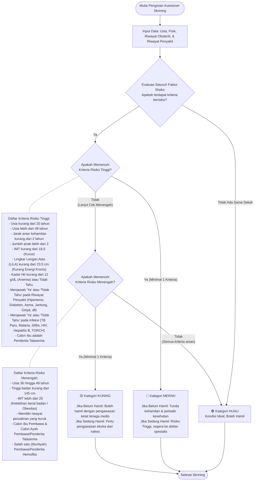

# Kescatin - Aplikasi Skrining Kehamilan

Selamat datang di repositori aplikasi Kescatin. Aplikasi ini digunakan untuk melakukan skrining kesehatan pada Calon Pengantin (Catin) untuk menentukan kelayakan kehamilan berdasarkan faktor-faktor medis.

## Alur Kuesioner Skrining Kehamilan

Aplikasi menentukan status kelayakan hamil menjadi 3 kategori utama:
1. **Hijau**: Kondisi ideal, boleh hamil.
2. **Kuning**: Risiko menengah, boleh hamil dengan pengawasan dokter.
3. **Merah**: Risiko tinggi, tunda kehamilan dan segera perbaiki kesehatan (atau perlu ke dokter spesialis jika sedang hamil).

Berikut adalah alur bagaimana aplikasi menyimpulkan status skrining dari pengisian data fisik dan riwayat kesehatan.

